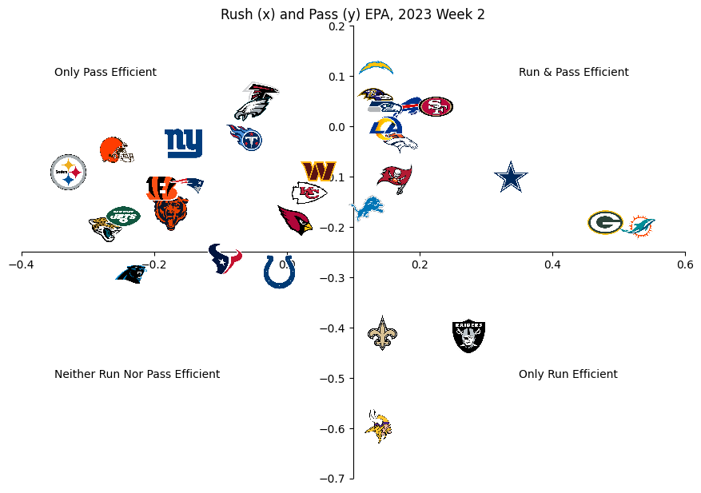

---
jupyter:
  colab:
  kernelspec:
    display_name: Python 3
    name: python3
  language_info:
    name: python
  nbformat: 4
  nbformat_minor: 0
---

::: {.cell .code id="XBM4tCJlJCn7"}
``` python
!pip install nfl_data_py
!pip install pandas
!pip install matplotlib
```
:::

::: {.cell .code execution_count="3" id="fzBVNvYTJI6y"}
``` python
import nfl_data_py as nfl
import pandas as pd
import os
import urllib.request
import matplotlib.pyplot as plt
from matplotlib.offsetbox import AnnotationBbox, OffsetImage
```
:::

::: {.cell .code id="LhI99X6BJK3y"}
``` python
pbp = nfl.import_pbp_data([2023])
# before cleaning data
pbp.shape
```
:::

::: {.cell .code execution_count="12" colab="{\"base_uri\":\"https://localhost:8080/\"}" id="-DpYZ3EMpGHd" outputId="79fbc2a0-7d1f-40a0-c561-9783546a2f00"}
``` python
print(pbp.columns.values)
```

::: {.output .stream .stdout}
    ['play_id' 'game_id' 'old_game_id' 'home_team' 'away_team' 'season_type'
     'week' 'posteam' 'posteam_type' 'defteam' 'side_of_field' 'yardline_100'
     'game_date' 'quarter_seconds_remaining' 'half_seconds_remaining'
     'game_seconds_remaining' 'game_half' 'quarter_end' 'drive' 'sp' 'qtr'
     'down' 'goal_to_go' 'time' 'yrdln' 'ydstogo' 'ydsnet' 'desc' 'play_type'
     'yards_gained' 'shotgun' 'no_huddle' 'qb_dropback' 'qb_kneel' 'qb_spike'
     'qb_scramble' 'pass_length' 'pass_location' 'air_yards'
     'yards_after_catch' 'run_location' 'run_gap' 'field_goal_result'
     'kick_distance' 'extra_point_result' 'two_point_conv_result'
     'home_timeouts_remaining' 'away_timeouts_remaining' 'timeout'
     'timeout_team' 'td_team' 'td_player_name' 'td_player_id'
     'posteam_timeouts_remaining' 'defteam_timeouts_remaining'
     'total_home_score' 'total_away_score' 'posteam_score' 'defteam_score'
     'score_differential' 'posteam_score_post' 'defteam_score_post'
     'score_differential_post' 'no_score_prob' 'opp_fg_prob' 'opp_safety_prob'
     'opp_td_prob' 'fg_prob' 'safety_prob' 'td_prob' 'extra_point_prob'
     'two_point_conversion_prob' 'ep' 'epa' 'total_home_epa' 'total_away_epa'
     'total_home_rush_epa' 'total_away_rush_epa' 'total_home_pass_epa'
     'total_away_pass_epa' 'air_epa' 'yac_epa' 'comp_air_epa' 'comp_yac_epa'
     'total_home_comp_air_epa' 'total_away_comp_air_epa'
     'total_home_comp_yac_epa' 'total_away_comp_yac_epa'
     'total_home_raw_air_epa' 'total_away_raw_air_epa'
     'total_home_raw_yac_epa' 'total_away_raw_yac_epa' 'wp' 'def_wp' 'home_wp'
     'away_wp' 'wpa' 'vegas_wpa' 'vegas_home_wpa' 'home_wp_post'
     'away_wp_post' 'vegas_wp' 'vegas_home_wp' 'total_home_rush_wpa'
     'total_away_rush_wpa' 'total_home_pass_wpa' 'total_away_pass_wpa'
     'air_wpa' 'yac_wpa' 'comp_air_wpa' 'comp_yac_wpa'
     'total_home_comp_air_wpa' 'total_away_comp_air_wpa'
     'total_home_comp_yac_wpa' 'total_away_comp_yac_wpa'
     'total_home_raw_air_wpa' 'total_away_raw_air_wpa'
     'total_home_raw_yac_wpa' 'total_away_raw_yac_wpa' 'punt_blocked'
     'first_down_rush' 'first_down_pass' 'first_down_penalty'
     'third_down_converted' 'third_down_failed' 'fourth_down_converted'
     'fourth_down_failed' 'incomplete_pass' 'touchback' 'interception'
     'punt_inside_twenty' 'punt_in_endzone' 'punt_out_of_bounds' 'punt_downed'
     'punt_fair_catch' 'kickoff_inside_twenty' 'kickoff_in_endzone'
     'kickoff_out_of_bounds' 'kickoff_downed' 'kickoff_fair_catch'
     'fumble_forced' 'fumble_not_forced' 'fumble_out_of_bounds' 'solo_tackle'
     'safety' 'penalty' 'tackled_for_loss' 'fumble_lost'
     'own_kickoff_recovery' 'own_kickoff_recovery_td' 'qb_hit' 'rush_attempt'
     'pass_attempt' 'sack' 'touchdown' 'pass_touchdown' 'rush_touchdown'
     'return_touchdown' 'extra_point_attempt' 'two_point_attempt'
     'field_goal_attempt' 'kickoff_attempt' 'punt_attempt' 'fumble'
     'complete_pass' 'assist_tackle' 'lateral_reception' 'lateral_rush'
     'lateral_return' 'lateral_recovery' 'passer_player_id'
     'passer_player_name' 'passing_yards' 'receiver_player_id'
     'receiver_player_name' 'receiving_yards' 'rusher_player_id'
     'rusher_player_name' 'rushing_yards' 'lateral_receiver_player_id'
     'lateral_receiver_player_name' 'lateral_receiving_yards'
     'lateral_rusher_player_id' 'lateral_rusher_player_name'
     'lateral_rushing_yards' 'lateral_sack_player_id'
     'lateral_sack_player_name' 'interception_player_id'
     'interception_player_name' 'lateral_interception_player_id'
     'lateral_interception_player_name' 'punt_returner_player_id'
     'punt_returner_player_name' 'lateral_punt_returner_player_id'
     'lateral_punt_returner_player_name' 'kickoff_returner_player_name'
     'kickoff_returner_player_id' 'lateral_kickoff_returner_player_id'
     'lateral_kickoff_returner_player_name' 'punter_player_id'
     'punter_player_name' 'kicker_player_name' 'kicker_player_id'
     'own_kickoff_recovery_player_id' 'own_kickoff_recovery_player_name'
     'blocked_player_id' 'blocked_player_name' 'tackle_for_loss_1_player_id'
     'tackle_for_loss_1_player_name' 'tackle_for_loss_2_player_id'
     'tackle_for_loss_2_player_name' 'qb_hit_1_player_id'
     'qb_hit_1_player_name' 'qb_hit_2_player_id' 'qb_hit_2_player_name'
     'forced_fumble_player_1_team' 'forced_fumble_player_1_player_id'
     'forced_fumble_player_1_player_name' 'forced_fumble_player_2_team'
     'forced_fumble_player_2_player_id' 'forced_fumble_player_2_player_name'
     'solo_tackle_1_team' 'solo_tackle_2_team' 'solo_tackle_1_player_id'
     'solo_tackle_2_player_id' 'solo_tackle_1_player_name'
     'solo_tackle_2_player_name' 'assist_tackle_1_player_id'
     'assist_tackle_1_player_name' 'assist_tackle_1_team'
     'assist_tackle_2_player_id' 'assist_tackle_2_player_name'
     'assist_tackle_2_team' 'assist_tackle_3_player_id'
     'assist_tackle_3_player_name' 'assist_tackle_3_team'
     'assist_tackle_4_player_id' 'assist_tackle_4_player_name'
     'assist_tackle_4_team' 'tackle_with_assist'
     'tackle_with_assist_1_player_id' 'tackle_with_assist_1_player_name'
     'tackle_with_assist_1_team' 'tackle_with_assist_2_player_id'
     'tackle_with_assist_2_player_name' 'tackle_with_assist_2_team'
     'pass_defense_1_player_id' 'pass_defense_1_player_name'
     'pass_defense_2_player_id' 'pass_defense_2_player_name' 'fumbled_1_team'
     'fumbled_1_player_id' 'fumbled_1_player_name' 'fumbled_2_player_id'
     'fumbled_2_player_name' 'fumbled_2_team' 'fumble_recovery_1_team'
     'fumble_recovery_1_yards' 'fumble_recovery_1_player_id'
     'fumble_recovery_1_player_name' 'fumble_recovery_2_team'
     'fumble_recovery_2_yards' 'fumble_recovery_2_player_id'
     'fumble_recovery_2_player_name' 'sack_player_id' 'sack_player_name'
     'half_sack_1_player_id' 'half_sack_1_player_name' 'half_sack_2_player_id'
     'half_sack_2_player_name' 'return_team' 'return_yards' 'penalty_team'
     'penalty_player_id' 'penalty_player_name' 'penalty_yards'
     'replay_or_challenge' 'replay_or_challenge_result' 'penalty_type'
     'defensive_two_point_attempt' 'defensive_two_point_conv'
     'defensive_extra_point_attempt' 'defensive_extra_point_conv'
     'safety_player_name' 'safety_player_id' 'season' 'cp' 'cpoe' 'series'
     'series_success' 'series_result' 'order_sequence' 'start_time'
     'time_of_day' 'stadium' 'weather' 'nfl_api_id' 'play_clock'
     'play_deleted' 'play_type_nfl' 'special_teams_play' 'st_play_type'
     'end_clock_time' 'end_yard_line' 'fixed_drive' 'fixed_drive_result'
     'drive_real_start_time' 'drive_play_count' 'drive_time_of_possession'
     'drive_first_downs' 'drive_inside20' 'drive_ended_with_score'
     'drive_quarter_start' 'drive_quarter_end' 'drive_yards_penalized'
     'drive_start_transition' 'drive_end_transition' 'drive_game_clock_start'
     'drive_game_clock_end' 'drive_start_yard_line' 'drive_end_yard_line'
     'drive_play_id_started' 'drive_play_id_ended' 'away_score' 'home_score'
     'location' 'result' 'total' 'spread_line' 'total_line' 'div_game' 'roof'
     'surface' 'temp' 'wind' 'home_coach' 'away_coach' 'stadium_id'
     'game_stadium' 'aborted_play' 'success' 'passer' 'passer_jersey_number'
     'rusher' 'rusher_jersey_number' 'receiver' 'receiver_jersey_number'
     'pass' 'rush' 'first_down' 'special' 'play' 'passer_id' 'rusher_id'
     'receiver_id' 'name' 'jersey_number' 'id' 'fantasy_player_name'
     'fantasy_player_id' 'fantasy' 'fantasy_id' 'out_of_bounds'
     'home_opening_kickoff' 'qb_epa' 'xyac_epa' 'xyac_mean_yardage'
     'xyac_median_yardage' 'xyac_success' 'xyac_fd' 'xpass' 'pass_oe'
     'nflverse_game_id' 'possession_team' 'offense_formation'
     'offense_personnel' 'defenders_in_box' 'defense_personnel'
     'number_of_pass_rushers' 'players_on_play' 'offense_players'
     'defense_players' 'n_offense' 'n_defense']
:::
:::

::: {.cell .code colab="{\"base_uri\":\"https://localhost:8080/\"}" id="HVryf50IJmGc" outputId="7f8dcd2d-aa52-4f9a-b3e3-c9c83ab8aa69"}
``` python
# checks for rows where either the 'pass' column equals 1 or the 'rush' column equals 1. The result is a DataFrame containing only these selected plays.
pbp_rp = pbp[(pbp['pass'] == 1) | (pbp['rush'] == 1)]
# removes rows where any of the columns 'epa', 'posteam', or 'defteam' have missing (NaN) values.
pbp_rp = pbp_rp.dropna(subset=['epa', 'posteam', 'defteam'])
pbp_rp.shape
```

::: {.output .execute_result execution_count="8"}
    (3946, 384)
:::
:::

::: {.cell .code colab="{\"base_uri\":\"https://localhost:8080/\",\"height\":1000}" id="xb3Kms1MJpli" outputId="4ebcc920-69da-42cf-83ed-21d8bb84142d"}
``` python
pass_epa = pbp_rp[(pbp_rp['pass'] == 1)].groupby('posteam')['epa'].mean().reset_index().rename(columns = {'epa' : 'pass_epa'})
pass_epa.sort_values('pass_epa', ascending = False)
```

::: {.output .execute_result execution_count="9"}
```{=html}

  <div id="df-c8e84dce-4ede-482d-82bf-f06621c0bb02" class="colab-df-container">
    <div>
<style scoped>
    .dataframe tbody tr th:only-of-type {
        vertical-align: middle;
    }

    .dataframe tbody tr th {
        vertical-align: top;
    }

    .dataframe thead th {
        text-align: right;
    }
</style>
<table border="1" class="dataframe">
  <thead>
    <tr style="text-align: right;">
      <th></th>
      <th>posteam</th>
      <th>pass_epa</th>
    </tr>
  </thead>
  <tbody>
    <tr>
      <th>19</th>
      <td>MIA</td>
      <td>0.529096</td>
    </tr>
    <tr>
      <th>11</th>
      <td>GB</td>
      <td>0.480721</td>
    </tr>
    <tr>
      <th>8</th>
      <td>DAL</td>
      <td>0.337637</td>
    </tr>
    <tr>
      <th>18</th>
      <td>LV</td>
      <td>0.274470</td>
    </tr>
    <tr>
      <th>28</th>
      <td>SF</td>
      <td>0.224288</td>
    </tr>
    <tr>
      <th>3</th>
      <td>BUF</td>
      <td>0.182382</td>
    </tr>
    <tr>
      <th>9</th>
      <td>DEN</td>
      <td>0.170232</td>
    </tr>
    <tr>
      <th>29</th>
      <td>TB</td>
      <td>0.162691</td>
    </tr>
    <tr>
      <th>16</th>
      <td>LA</td>
      <td>0.149403</td>
    </tr>
    <tr>
      <th>27</th>
      <td>SEA</td>
      <td>0.147579</td>
    </tr>
    <tr>
      <th>22</th>
      <td>NO</td>
      <td>0.143451</td>
    </tr>
    <tr>
      <th>20</th>
      <td>MIN</td>
      <td>0.137279</td>
    </tr>
    <tr>
      <th>17</th>
      <td>LAC</td>
      <td>0.134217</td>
    </tr>
    <tr>
      <th>2</th>
      <td>BAL</td>
      <td>0.133098</td>
    </tr>
    <tr>
      <th>10</th>
      <td>DET</td>
      <td>0.120361</td>
    </tr>
    <tr>
      <th>31</th>
      <td>WAS</td>
      <td>0.047263</td>
    </tr>
    <tr>
      <th>15</th>
      <td>KC</td>
      <td>0.033872</td>
    </tr>
    <tr>
      <th>0</th>
      <td>ARI</td>
      <td>0.011009</td>
    </tr>
    <tr>
      <th>13</th>
      <td>IND</td>
      <td>-0.011303</td>
    </tr>
    <tr>
      <th>1</th>
      <td>ATL</td>
      <td>-0.039579</td>
    </tr>
    <tr>
      <th>25</th>
      <td>PHI</td>
      <td>-0.052359</td>
    </tr>
    <tr>
      <th>30</th>
      <td>TEN</td>
      <td>-0.063982</td>
    </tr>
    <tr>
      <th>12</th>
      <td>HOU</td>
      <td>-0.092872</td>
    </tr>
    <tr>
      <th>21</th>
      <td>NE</td>
      <td>-0.149698</td>
    </tr>
    <tr>
      <th>23</th>
      <td>NYG</td>
      <td>-0.155408</td>
    </tr>
    <tr>
      <th>5</th>
      <td>CHI</td>
      <td>-0.174690</td>
    </tr>
    <tr>
      <th>6</th>
      <td>CIN</td>
      <td>-0.190140</td>
    </tr>
    <tr>
      <th>4</th>
      <td>CAR</td>
      <td>-0.233964</td>
    </tr>
    <tr>
      <th>24</th>
      <td>NYJ</td>
      <td>-0.245736</td>
    </tr>
    <tr>
      <th>7</th>
      <td>CLE</td>
      <td>-0.255619</td>
    </tr>
    <tr>
      <th>14</th>
      <td>JAX</td>
      <td>-0.274408</td>
    </tr>
    <tr>
      <th>26</th>
      <td>PIT</td>
      <td>-0.329864</td>
    </tr>
  </tbody>
</table>
</div>
    <div class="colab-df-buttons">

  <div class="colab-df-container">
    <button class="colab-df-convert" onclick="convertToInteractive('df-c8e84dce-4ede-482d-82bf-f06621c0bb02')"
            title="Convert this dataframe to an interactive table."
            style="display:none;">

  <svg xmlns="http://www.w3.org/2000/svg" height="24px" viewBox="0 -960 960 960">
    <path d="M120-120v-720h720v720H120Zm60-500h600v-160H180v160Zm220 220h160v-160H400v160Zm0 220h160v-160H400v160ZM180-400h160v-160H180v160Zm440 0h160v-160H620v160ZM180-180h160v-160H180v160Zm440 0h160v-160H620v160Z"/>
  </svg>
    </button>

  <style>
    .colab-df-container {
      display:flex;
      gap: 12px;
    }

    .colab-df-convert {
      background-color: #E8F0FE;
      border: none;
      border-radius: 50%;
      cursor: pointer;
      display: none;
      fill: #1967D2;
      height: 32px;
      padding: 0 0 0 0;
      width: 32px;
    }

    .colab-df-convert:hover {
      background-color: #E2EBFA;
      box-shadow: 0px 1px 2px rgba(60, 64, 67, 0.3), 0px 1px 3px 1px rgba(60, 64, 67, 0.15);
      fill: #174EA6;
    }

    .colab-df-buttons div {
      margin-bottom: 4px;
    }

    [theme=dark] .colab-df-convert {
      background-color: #3B4455;
      fill: #D2E3FC;
    }

    [theme=dark] .colab-df-convert:hover {
      background-color: #434B5C;
      box-shadow: 0px 1px 3px 1px rgba(0, 0, 0, 0.15);
      filter: drop-shadow(0px 1px 2px rgba(0, 0, 0, 0.3));
      fill: #FFFFFF;
    }
  </style>

    <script>
      const buttonEl =
        document.querySelector('#df-c8e84dce-4ede-482d-82bf-f06621c0bb02 button.colab-df-convert');
      buttonEl.style.display =
        google.colab.kernel.accessAllowed ? 'block' : 'none';

      async function convertToInteractive(key) {
        const element = document.querySelector('#df-c8e84dce-4ede-482d-82bf-f06621c0bb02');
        const dataTable =
          await google.colab.kernel.invokeFunction('convertToInteractive',
                                                    [key], {});
        if (!dataTable) return;

        const docLinkHtml = 'Like what you see? Visit the ' +
          '<a target="_blank" href=https://colab.research.google.com/notebooks/data_table.ipynb>data table notebook</a>'
          + ' to learn more about interactive tables.';
        element.innerHTML = '';
        dataTable['output_type'] = 'display_data';
        await google.colab.output.renderOutput(dataTable, element);
        const docLink = document.createElement('div');
        docLink.innerHTML = docLinkHtml;
        element.appendChild(docLink);
      }
    </script>
  </div>


<div id="df-230fb797-2a9b-468c-97ef-b27ceb3ff9d2">
  <button class="colab-df-quickchart" onclick="quickchart('df-230fb797-2a9b-468c-97ef-b27ceb3ff9d2')"
            title="Suggest charts."
            style="display:none;">

<svg xmlns="http://www.w3.org/2000/svg" height="24px"viewBox="0 0 24 24"
     width="24px">
    <g>
        <path d="M19 3H5c-1.1 0-2 .9-2 2v14c0 1.1.9 2 2 2h14c1.1 0 2-.9 2-2V5c0-1.1-.9-2-2-2zM9 17H7v-7h2v7zm4 0h-2V7h2v10zm4 0h-2v-4h2v4z"/>
    </g>
</svg>
  </button>

<style>
  .colab-df-quickchart {
      --bg-color: #E8F0FE;
      --fill-color: #1967D2;
      --hover-bg-color: #E2EBFA;
      --hover-fill-color: #174EA6;
      --disabled-fill-color: #AAA;
      --disabled-bg-color: #DDD;
  }

  [theme=dark] .colab-df-quickchart {
      --bg-color: #3B4455;
      --fill-color: #D2E3FC;
      --hover-bg-color: #434B5C;
      --hover-fill-color: #FFFFFF;
      --disabled-bg-color: #3B4455;
      --disabled-fill-color: #666;
  }

  .colab-df-quickchart {
    background-color: var(--bg-color);
    border: none;
    border-radius: 50%;
    cursor: pointer;
    display: none;
    fill: var(--fill-color);
    height: 32px;
    padding: 0;
    width: 32px;
  }

  .colab-df-quickchart:hover {
    background-color: var(--hover-bg-color);
    box-shadow: 0 1px 2px rgba(60, 64, 67, 0.3), 0 1px 3px 1px rgba(60, 64, 67, 0.15);
    fill: var(--button-hover-fill-color);
  }

  .colab-df-quickchart-complete:disabled,
  .colab-df-quickchart-complete:disabled:hover {
    background-color: var(--disabled-bg-color);
    fill: var(--disabled-fill-color);
    box-shadow: none;
  }

  .colab-df-spinner {
    border: 2px solid var(--fill-color);
    border-color: transparent;
    border-bottom-color: var(--fill-color);
    animation:
      spin 1s steps(1) infinite;
  }

  @keyframes spin {
    0% {
      border-color: transparent;
      border-bottom-color: var(--fill-color);
      border-left-color: var(--fill-color);
    }
    20% {
      border-color: transparent;
      border-left-color: var(--fill-color);
      border-top-color: var(--fill-color);
    }
    30% {
      border-color: transparent;
      border-left-color: var(--fill-color);
      border-top-color: var(--fill-color);
      border-right-color: var(--fill-color);
    }
    40% {
      border-color: transparent;
      border-right-color: var(--fill-color);
      border-top-color: var(--fill-color);
    }
    60% {
      border-color: transparent;
      border-right-color: var(--fill-color);
    }
    80% {
      border-color: transparent;
      border-right-color: var(--fill-color);
      border-bottom-color: var(--fill-color);
    }
    90% {
      border-color: transparent;
      border-bottom-color: var(--fill-color);
    }
  }
</style>

  <script>
    async function quickchart(key) {
      const quickchartButtonEl =
        document.querySelector('#' + key + ' button');
      quickchartButtonEl.disabled = true;  // To prevent multiple clicks.
      quickchartButtonEl.classList.add('colab-df-spinner');
      try {
        const charts = await google.colab.kernel.invokeFunction(
            'suggestCharts', [key], {});
      } catch (error) {
        console.error('Error during call to suggestCharts:', error);
      }
      quickchartButtonEl.classList.remove('colab-df-spinner');
      quickchartButtonEl.classList.add('colab-df-quickchart-complete');
    }
    (() => {
      let quickchartButtonEl =
        document.querySelector('#df-230fb797-2a9b-468c-97ef-b27ceb3ff9d2 button');
      quickchartButtonEl.style.display =
        google.colab.kernel.accessAllowed ? 'block' : 'none';
    })();
  </script>
</div>
    </div>
  </div>
```
:::
:::

::: {.cell .code colab="{\"base_uri\":\"https://localhost:8080/\",\"height\":1000}" id="LtrFY4WnJvXp" outputId="bfe5986e-47bb-4b84-e714-5acd19584206"}
``` python
rush_epa = pbp_rp[(pbp_rp['rush'] == 1)].groupby('posteam')['epa'].mean().reset_index().rename(columns = {'epa' : 'rush_epa'})
epa = pd.merge(pass_epa, rush_epa, on = 'posteam')
rush_epa.sort_values('rush_epa', ascending = False)
```

::: {.output .execute_result execution_count="19"}
```{=html}

  <div id="df-601cd0fc-c9b4-4597-a419-70890b39b805" class="colab-df-container">
    <div>
<style scoped>
    .dataframe tbody tr th:only-of-type {
        vertical-align: middle;
    }

    .dataframe tbody tr th {
        vertical-align: top;
    }

    .dataframe thead th {
        text-align: right;
    }
</style>
<table border="1" class="dataframe">
  <thead>
    <tr style="text-align: right;">
      <th></th>
      <th>posteam</th>
      <th>rush_epa</th>
    </tr>
  </thead>
  <tbody>
    <tr>
      <th>17</th>
      <td>LAC</td>
      <td>0.114938</td>
    </tr>
    <tr>
      <th>2</th>
      <td>BAL</td>
      <td>0.058610</td>
    </tr>
    <tr>
      <th>1</th>
      <td>ATL</td>
      <td>0.053944</td>
    </tr>
    <tr>
      <th>28</th>
      <td>SF</td>
      <td>0.037771</td>
    </tr>
    <tr>
      <th>27</th>
      <td>SEA</td>
      <td>0.037319</td>
    </tr>
    <tr>
      <th>3</th>
      <td>BUF</td>
      <td>0.034934</td>
    </tr>
    <tr>
      <th>25</th>
      <td>PHI</td>
      <td>0.033765</td>
    </tr>
    <tr>
      <th>16</th>
      <td>LA</td>
      <td>-0.004004</td>
    </tr>
    <tr>
      <th>30</th>
      <td>TEN</td>
      <td>-0.023112</td>
    </tr>
    <tr>
      <th>9</th>
      <td>DEN</td>
      <td>-0.033659</td>
    </tr>
    <tr>
      <th>23</th>
      <td>NYG</td>
      <td>-0.034905</td>
    </tr>
    <tr>
      <th>7</th>
      <td>CLE</td>
      <td>-0.047430</td>
    </tr>
    <tr>
      <th>31</th>
      <td>WAS</td>
      <td>-0.090271</td>
    </tr>
    <tr>
      <th>26</th>
      <td>PIT</td>
      <td>-0.092361</td>
    </tr>
    <tr>
      <th>8</th>
      <td>DAL</td>
      <td>-0.100292</td>
    </tr>
    <tr>
      <th>29</th>
      <td>TB</td>
      <td>-0.106580</td>
    </tr>
    <tr>
      <th>21</th>
      <td>NE</td>
      <td>-0.118396</td>
    </tr>
    <tr>
      <th>6</th>
      <td>CIN</td>
      <td>-0.123596</td>
    </tr>
    <tr>
      <th>15</th>
      <td>KC</td>
      <td>-0.132583</td>
    </tr>
    <tr>
      <th>10</th>
      <td>DET</td>
      <td>-0.162854</td>
    </tr>
    <tr>
      <th>5</th>
      <td>CHI</td>
      <td>-0.173352</td>
    </tr>
    <tr>
      <th>24</th>
      <td>NYJ</td>
      <td>-0.178719</td>
    </tr>
    <tr>
      <th>0</th>
      <td>ARI</td>
      <td>-0.187182</td>
    </tr>
    <tr>
      <th>11</th>
      <td>GB</td>
      <td>-0.192753</td>
    </tr>
    <tr>
      <th>19</th>
      <td>MIA</td>
      <td>-0.200182</td>
    </tr>
    <tr>
      <th>14</th>
      <td>JAX</td>
      <td>-0.207134</td>
    </tr>
    <tr>
      <th>12</th>
      <td>HOU</td>
      <td>-0.265292</td>
    </tr>
    <tr>
      <th>13</th>
      <td>IND</td>
      <td>-0.289986</td>
    </tr>
    <tr>
      <th>4</th>
      <td>CAR</td>
      <td>-0.295334</td>
    </tr>
    <tr>
      <th>22</th>
      <td>NO</td>
      <td>-0.410586</td>
    </tr>
    <tr>
      <th>18</th>
      <td>LV</td>
      <td>-0.418213</td>
    </tr>
    <tr>
      <th>20</th>
      <td>MIN</td>
      <td>-0.596395</td>
    </tr>
  </tbody>
</table>
</div>
    <div class="colab-df-buttons">

  <div class="colab-df-container">
    <button class="colab-df-convert" onclick="convertToInteractive('df-601cd0fc-c9b4-4597-a419-70890b39b805')"
            title="Convert this dataframe to an interactive table."
            style="display:none;">

  <svg xmlns="http://www.w3.org/2000/svg" height="24px" viewBox="0 -960 960 960">
    <path d="M120-120v-720h720v720H120Zm60-500h600v-160H180v160Zm220 220h160v-160H400v160Zm0 220h160v-160H400v160ZM180-400h160v-160H180v160Zm440 0h160v-160H620v160ZM180-180h160v-160H180v160Zm440 0h160v-160H620v160Z"/>
  </svg>
    </button>

  <style>
    .colab-df-container {
      display:flex;
      gap: 12px;
    }

    .colab-df-convert {
      background-color: #E8F0FE;
      border: none;
      border-radius: 50%;
      cursor: pointer;
      display: none;
      fill: #1967D2;
      height: 32px;
      padding: 0 0 0 0;
      width: 32px;
    }

    .colab-df-convert:hover {
      background-color: #E2EBFA;
      box-shadow: 0px 1px 2px rgba(60, 64, 67, 0.3), 0px 1px 3px 1px rgba(60, 64, 67, 0.15);
      fill: #174EA6;
    }

    .colab-df-buttons div {
      margin-bottom: 4px;
    }

    [theme=dark] .colab-df-convert {
      background-color: #3B4455;
      fill: #D2E3FC;
    }

    [theme=dark] .colab-df-convert:hover {
      background-color: #434B5C;
      box-shadow: 0px 1px 3px 1px rgba(0, 0, 0, 0.15);
      filter: drop-shadow(0px 1px 2px rgba(0, 0, 0, 0.3));
      fill: #FFFFFF;
    }
  </style>

    <script>
      const buttonEl =
        document.querySelector('#df-601cd0fc-c9b4-4597-a419-70890b39b805 button.colab-df-convert');
      buttonEl.style.display =
        google.colab.kernel.accessAllowed ? 'block' : 'none';

      async function convertToInteractive(key) {
        const element = document.querySelector('#df-601cd0fc-c9b4-4597-a419-70890b39b805');
        const dataTable =
          await google.colab.kernel.invokeFunction('convertToInteractive',
                                                    [key], {});
        if (!dataTable) return;

        const docLinkHtml = 'Like what you see? Visit the ' +
          '<a target="_blank" href=https://colab.research.google.com/notebooks/data_table.ipynb>data table notebook</a>'
          + ' to learn more about interactive tables.';
        element.innerHTML = '';
        dataTable['output_type'] = 'display_data';
        await google.colab.output.renderOutput(dataTable, element);
        const docLink = document.createElement('div');
        docLink.innerHTML = docLinkHtml;
        element.appendChild(docLink);
      }
    </script>
  </div>


<div id="df-d36f6610-622e-4e16-ad57-7739743df2b2">
  <button class="colab-df-quickchart" onclick="quickchart('df-d36f6610-622e-4e16-ad57-7739743df2b2')"
            title="Suggest charts."
            style="display:none;">

<svg xmlns="http://www.w3.org/2000/svg" height="24px"viewBox="0 0 24 24"
     width="24px">
    <g>
        <path d="M19 3H5c-1.1 0-2 .9-2 2v14c0 1.1.9 2 2 2h14c1.1 0 2-.9 2-2V5c0-1.1-.9-2-2-2zM9 17H7v-7h2v7zm4 0h-2V7h2v10zm4 0h-2v-4h2v4z"/>
    </g>
</svg>
  </button>

<style>
  .colab-df-quickchart {
      --bg-color: #E8F0FE;
      --fill-color: #1967D2;
      --hover-bg-color: #E2EBFA;
      --hover-fill-color: #174EA6;
      --disabled-fill-color: #AAA;
      --disabled-bg-color: #DDD;
  }

  [theme=dark] .colab-df-quickchart {
      --bg-color: #3B4455;
      --fill-color: #D2E3FC;
      --hover-bg-color: #434B5C;
      --hover-fill-color: #FFFFFF;
      --disabled-bg-color: #3B4455;
      --disabled-fill-color: #666;
  }

  .colab-df-quickchart {
    background-color: var(--bg-color);
    border: none;
    border-radius: 50%;
    cursor: pointer;
    display: none;
    fill: var(--fill-color);
    height: 32px;
    padding: 0;
    width: 32px;
  }

  .colab-df-quickchart:hover {
    background-color: var(--hover-bg-color);
    box-shadow: 0 1px 2px rgba(60, 64, 67, 0.3), 0 1px 3px 1px rgba(60, 64, 67, 0.15);
    fill: var(--button-hover-fill-color);
  }

  .colab-df-quickchart-complete:disabled,
  .colab-df-quickchart-complete:disabled:hover {
    background-color: var(--disabled-bg-color);
    fill: var(--disabled-fill-color);
    box-shadow: none;
  }

  .colab-df-spinner {
    border: 2px solid var(--fill-color);
    border-color: transparent;
    border-bottom-color: var(--fill-color);
    animation:
      spin 1s steps(1) infinite;
  }

  @keyframes spin {
    0% {
      border-color: transparent;
      border-bottom-color: var(--fill-color);
      border-left-color: var(--fill-color);
    }
    20% {
      border-color: transparent;
      border-left-color: var(--fill-color);
      border-top-color: var(--fill-color);
    }
    30% {
      border-color: transparent;
      border-left-color: var(--fill-color);
      border-top-color: var(--fill-color);
      border-right-color: var(--fill-color);
    }
    40% {
      border-color: transparent;
      border-right-color: var(--fill-color);
      border-top-color: var(--fill-color);
    }
    60% {
      border-color: transparent;
      border-right-color: var(--fill-color);
    }
    80% {
      border-color: transparent;
      border-right-color: var(--fill-color);
      border-bottom-color: var(--fill-color);
    }
    90% {
      border-color: transparent;
      border-bottom-color: var(--fill-color);
    }
  }
</style>

  <script>
    async function quickchart(key) {
      const quickchartButtonEl =
        document.querySelector('#' + key + ' button');
      quickchartButtonEl.disabled = true;  // To prevent multiple clicks.
      quickchartButtonEl.classList.add('colab-df-spinner');
      try {
        const charts = await google.colab.kernel.invokeFunction(
            'suggestCharts', [key], {});
      } catch (error) {
        console.error('Error during call to suggestCharts:', error);
      }
      quickchartButtonEl.classList.remove('colab-df-spinner');
      quickchartButtonEl.classList.add('colab-df-quickchart-complete');
    }
    (() => {
      let quickchartButtonEl =
        document.querySelector('#df-d36f6610-622e-4e16-ad57-7739743df2b2 button');
      quickchartButtonEl.style.display =
        google.colab.kernel.accessAllowed ? 'block' : 'none';
    })();
  </script>
</div>
    </div>
  </div>
```
:::
:::

::: {.cell .code colab="{\"base_uri\":\"https://localhost:8080/\",\"height\":206}" id="VsIQ9VG0J9hG" outputId="d521ce31-275f-4d0f-de86-f0d1b15b80b7"}
``` python
logos = nfl.import_team_desc()[['team_abbr', 'team_logo_espn']]
logos.head()
```

::: {.output .execute_result execution_count="13"}
```{=html}

  <div id="df-1f4f0243-58a9-454f-a6d3-a7c49661137d" class="colab-df-container">
    <div>
<style scoped>
    .dataframe tbody tr th:only-of-type {
        vertical-align: middle;
    }

    .dataframe tbody tr th {
        vertical-align: top;
    }

    .dataframe thead th {
        text-align: right;
    }
</style>
<table border="1" class="dataframe">
  <thead>
    <tr style="text-align: right;">
      <th></th>
      <th>team_abbr</th>
      <th>team_logo_espn</th>
    </tr>
  </thead>
  <tbody>
    <tr>
      <th>0</th>
      <td>ARI</td>
      <td>https://a.espncdn.com/i/teamlogos/nfl/500/ari.png</td>
    </tr>
    <tr>
      <th>1</th>
      <td>ATL</td>
      <td>https://a.espncdn.com/i/teamlogos/nfl/500/atl.png</td>
    </tr>
    <tr>
      <th>2</th>
      <td>BAL</td>
      <td>https://a.espncdn.com/i/teamlogos/nfl/500/bal.png</td>
    </tr>
    <tr>
      <th>3</th>
      <td>BUF</td>
      <td>https://a.espncdn.com/i/teamlogos/nfl/500/buf.png</td>
    </tr>
    <tr>
      <th>4</th>
      <td>CAR</td>
      <td>https://a.espncdn.com/i/teamlogos/nfl/500-dark...</td>
    </tr>
  </tbody>
</table>
</div>
    <div class="colab-df-buttons">

  <div class="colab-df-container">
    <button class="colab-df-convert" onclick="convertToInteractive('df-1f4f0243-58a9-454f-a6d3-a7c49661137d')"
            title="Convert this dataframe to an interactive table."
            style="display:none;">

  <svg xmlns="http://www.w3.org/2000/svg" height="24px" viewBox="0 -960 960 960">
    <path d="M120-120v-720h720v720H120Zm60-500h600v-160H180v160Zm220 220h160v-160H400v160Zm0 220h160v-160H400v160ZM180-400h160v-160H180v160Zm440 0h160v-160H620v160ZM180-180h160v-160H180v160Zm440 0h160v-160H620v160Z"/>
  </svg>
    </button>

  <style>
    .colab-df-container {
      display:flex;
      gap: 12px;
    }

    .colab-df-convert {
      background-color: #E8F0FE;
      border: none;
      border-radius: 50%;
      cursor: pointer;
      display: none;
      fill: #1967D2;
      height: 32px;
      padding: 0 0 0 0;
      width: 32px;
    }

    .colab-df-convert:hover {
      background-color: #E2EBFA;
      box-shadow: 0px 1px 2px rgba(60, 64, 67, 0.3), 0px 1px 3px 1px rgba(60, 64, 67, 0.15);
      fill: #174EA6;
    }

    .colab-df-buttons div {
      margin-bottom: 4px;
    }

    [theme=dark] .colab-df-convert {
      background-color: #3B4455;
      fill: #D2E3FC;
    }

    [theme=dark] .colab-df-convert:hover {
      background-color: #434B5C;
      box-shadow: 0px 1px 3px 1px rgba(0, 0, 0, 0.15);
      filter: drop-shadow(0px 1px 2px rgba(0, 0, 0, 0.3));
      fill: #FFFFFF;
    }
  </style>

    <script>
      const buttonEl =
        document.querySelector('#df-1f4f0243-58a9-454f-a6d3-a7c49661137d button.colab-df-convert');
      buttonEl.style.display =
        google.colab.kernel.accessAllowed ? 'block' : 'none';

      async function convertToInteractive(key) {
        const element = document.querySelector('#df-1f4f0243-58a9-454f-a6d3-a7c49661137d');
        const dataTable =
          await google.colab.kernel.invokeFunction('convertToInteractive',
                                                    [key], {});
        if (!dataTable) return;

        const docLinkHtml = 'Like what you see? Visit the ' +
          '<a target="_blank" href=https://colab.research.google.com/notebooks/data_table.ipynb>data table notebook</a>'
          + ' to learn more about interactive tables.';
        element.innerHTML = '';
        dataTable['output_type'] = 'display_data';
        await google.colab.output.renderOutput(dataTable, element);
        const docLink = document.createElement('div');
        docLink.innerHTML = docLinkHtml;
        element.appendChild(docLink);
      }
    </script>
  </div>


<div id="df-ecde6e41-6142-4826-ae84-be19d8636dd3">
  <button class="colab-df-quickchart" onclick="quickchart('df-ecde6e41-6142-4826-ae84-be19d8636dd3')"
            title="Suggest charts."
            style="display:none;">

<svg xmlns="http://www.w3.org/2000/svg" height="24px"viewBox="0 0 24 24"
     width="24px">
    <g>
        <path d="M19 3H5c-1.1 0-2 .9-2 2v14c0 1.1.9 2 2 2h14c1.1 0 2-.9 2-2V5c0-1.1-.9-2-2-2zM9 17H7v-7h2v7zm4 0h-2V7h2v10zm4 0h-2v-4h2v4z"/>
    </g>
</svg>
  </button>

<style>
  .colab-df-quickchart {
      --bg-color: #E8F0FE;
      --fill-color: #1967D2;
      --hover-bg-color: #E2EBFA;
      --hover-fill-color: #174EA6;
      --disabled-fill-color: #AAA;
      --disabled-bg-color: #DDD;
  }

  [theme=dark] .colab-df-quickchart {
      --bg-color: #3B4455;
      --fill-color: #D2E3FC;
      --hover-bg-color: #434B5C;
      --hover-fill-color: #FFFFFF;
      --disabled-bg-color: #3B4455;
      --disabled-fill-color: #666;
  }

  .colab-df-quickchart {
    background-color: var(--bg-color);
    border: none;
    border-radius: 50%;
    cursor: pointer;
    display: none;
    fill: var(--fill-color);
    height: 32px;
    padding: 0;
    width: 32px;
  }

  .colab-df-quickchart:hover {
    background-color: var(--hover-bg-color);
    box-shadow: 0 1px 2px rgba(60, 64, 67, 0.3), 0 1px 3px 1px rgba(60, 64, 67, 0.15);
    fill: var(--button-hover-fill-color);
  }

  .colab-df-quickchart-complete:disabled,
  .colab-df-quickchart-complete:disabled:hover {
    background-color: var(--disabled-bg-color);
    fill: var(--disabled-fill-color);
    box-shadow: none;
  }

  .colab-df-spinner {
    border: 2px solid var(--fill-color);
    border-color: transparent;
    border-bottom-color: var(--fill-color);
    animation:
      spin 1s steps(1) infinite;
  }

  @keyframes spin {
    0% {
      border-color: transparent;
      border-bottom-color: var(--fill-color);
      border-left-color: var(--fill-color);
    }
    20% {
      border-color: transparent;
      border-left-color: var(--fill-color);
      border-top-color: var(--fill-color);
    }
    30% {
      border-color: transparent;
      border-left-color: var(--fill-color);
      border-top-color: var(--fill-color);
      border-right-color: var(--fill-color);
    }
    40% {
      border-color: transparent;
      border-right-color: var(--fill-color);
      border-top-color: var(--fill-color);
    }
    60% {
      border-color: transparent;
      border-right-color: var(--fill-color);
    }
    80% {
      border-color: transparent;
      border-right-color: var(--fill-color);
      border-bottom-color: var(--fill-color);
    }
    90% {
      border-color: transparent;
      border-bottom-color: var(--fill-color);
    }
  }
</style>

  <script>
    async function quickchart(key) {
      const quickchartButtonEl =
        document.querySelector('#' + key + ' button');
      quickchartButtonEl.disabled = true;  // To prevent multiple clicks.
      quickchartButtonEl.classList.add('colab-df-spinner');
      try {
        const charts = await google.colab.kernel.invokeFunction(
            'suggestCharts', [key], {});
      } catch (error) {
        console.error('Error during call to suggestCharts:', error);
      }
      quickchartButtonEl.classList.remove('colab-df-spinner');
      quickchartButtonEl.classList.add('colab-df-quickchart-complete');
    }
    (() => {
      let quickchartButtonEl =
        document.querySelector('#df-ecde6e41-6142-4826-ae84-be19d8636dd3 button');
      quickchartButtonEl.style.display =
        google.colab.kernel.accessAllowed ? 'block' : 'none';
    })();
  </script>
</div>
    </div>
  </div>
```
:::
:::

::: {.cell .code id="EK_moxWRKAVB"}
``` python
logo_paths = []
team_abbr = []
if not os.path.exists("logos"):
    os.makedirs("logos")

for team in range(len(logos)):
    urllib.request.urlretrieve(logos['team_logo_espn'][team], f"logos/{logos['team_abbr'][team]}.tif")
    logo_paths.append(f"logos/{logos['team_abbr'][team]}.tif")
    team_abbr.append(logos['team_abbr'][team])

data = {'team_abbr' : team_abbr, 'logo_path' : logo_paths}
logo_data = pd.DataFrame(data)

epa_with_logos = pd.merge(epa, logo_data, left_on = 'posteam', right_on = 'team_abbr')
```
:::

::: {.cell .code colab="{\"base_uri\":\"https://localhost:8080/\",\"height\":634}" id="_7gtT1iCKEYZ" outputId="7a8582b1-5fd2-4f75-c69a-b17067715895"}
``` python
plt.rcParams["figure.figsize"] = [10, 7]
plt.rcParams["figure.autolayout"] = True

def getImage(path):
    return OffsetImage(plt.imread(path, format="tif"), zoom=.07)

x = epa_with_logos['pass_epa']
y = epa_with_logos['rush_epa']
paths = epa_with_logos['logo_path']

fig, ax = plt.subplots()

for x0, y0, path in zip(x, y, paths):
   ab = AnnotationBbox(getImage(path), (x0, y0), frameon=False)
   ax.add_artist(ab)

plt.xlim(-0.4, 0.6)
plt.ylim(-0.7, 0.2)
ax.spines['left'].set_position('center')
ax.spines['bottom'].set_position('center')

# Eliminate upper and right axes
ax.spines['right'].set_color('none')
ax.spines['top'].set_color('none')

# Show ticks in the left and lower axes only
ax.xaxis.set_ticks_position('bottom')
ax.yaxis.set_ticks_position('left')

plt.annotate("Run & Pass Efficient", (0.35, 0.1), fontsize=10)
plt.annotate("Only Pass Efficient", (-0.35, 0.1), fontsize=10)
plt.annotate("Neither Run Nor Pass Efficient", (-0.35, -0.5), fontsize=10)
plt.annotate("Only Run Efficient", (0.35, -0.5), fontsize=10)

plt.title("Rush (x) and Pass (y) EPA, 2023 Week 2")
plt.show()
```

::: {.output .display_data}

:::
:::
